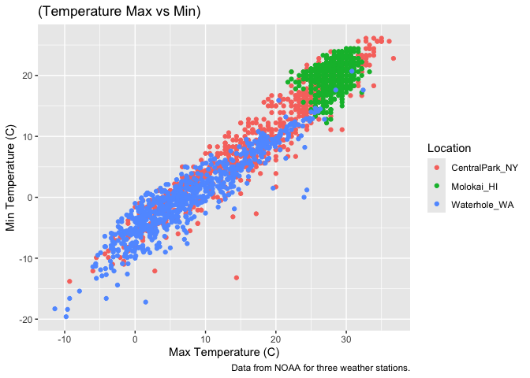
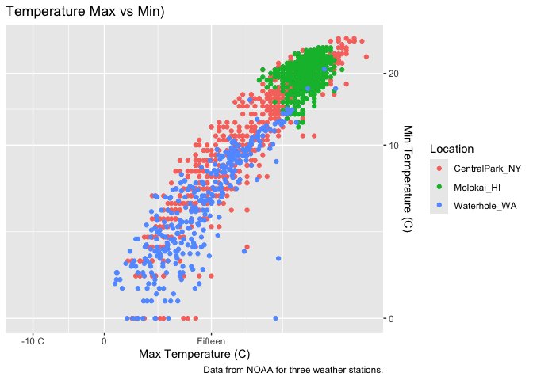
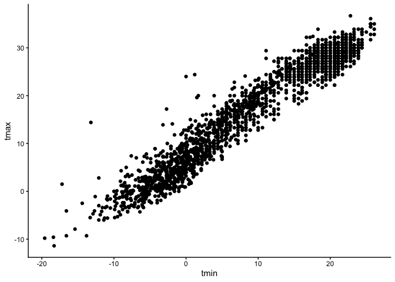
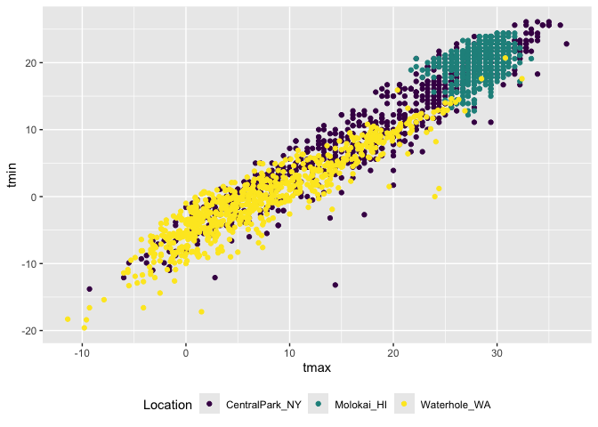
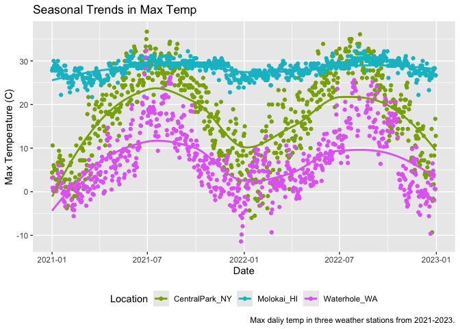
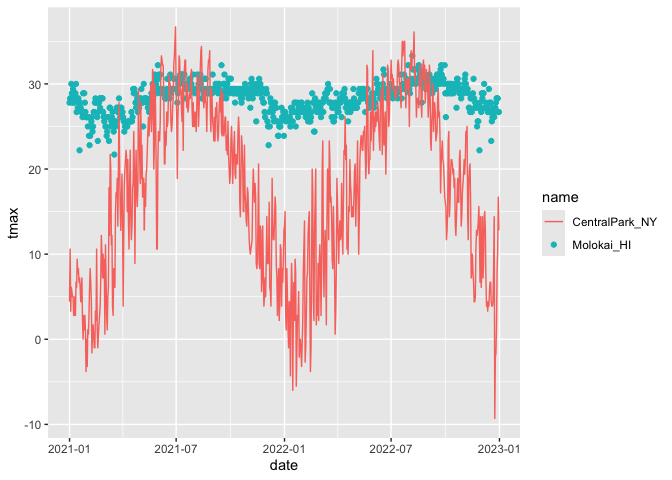

Visualization
================
2026-10-01

## Formatting plots

``` r
weather_df |>
ggplot(aes(x= tmax, y = tmin, color = name)) + 
  geom_point() +
  labs(
    title = "(Temperature Max vs Min)",
    x = "Max Temperature (C)",
    y = "Min Temperature (C)",
    color = "Location",
    caption = "Data from NOAA for three weather stations."
  )
```

    ## Warning: Removed 17 rows containing missing values or values outside the scale range
    ## (`geom_point()`).

<!-- -->

Transformations and setting the scale!

``` r
weather_df |>
ggplot(aes(x= tmax, y = tmin, color = name)) + 
  geom_point() +
  labs(
    title = "Temperature Max vs Min)",
    x = "Max Temperature (C)",
    y = "Min Temperature (C)",
    color = "Location",
    caption = "Data from NOAA for three weather stations."
  ) +
  scale_x_continuous(
    breaks = c(-10, 0 , 15),
    labels = c("-10 C", "0", "Fifteen")
  ) +
  scale_y_continuous(
    trans = "sqrt",
    position = "right"
  )
```

    ## Warning in transformation$transform(x): NaNs produced

    ## Warning in scale_y_continuous(trans = "sqrt", position = "right"): sqrt
    ## transformation introduced infinite values.

    ## Warning: Removed 520 rows containing missing values or values outside the scale range
    ## (`geom_point()`).

<!-- -->

Fun colours!

``` r
weather_df |>
  ggplot(aes(x = tmax, y = tmin, color = name)) +
  geom_point() + 
  scale_colour_hue(h = c(100, 300))
```

    ## Warning: Removed 17 rows containing missing values or values outside the scale range
    ## (`geom_point()`).

<!-- -->

More colours….

``` r
weather_df |>
  ggplot(aes(x = tmax, y = tmin, color = name)) +
  geom_point() + 
  viridis::scale_colour_viridis(
    name = "Location",
    discrete = TRUE
    )
```

    ## Warning: Removed 17 rows containing missing values or values outside the scale range
    ## (`geom_point()`).

<!-- -->

## Themes

``` r
weather_df |>
  ggplot(aes(x= tmin, y = tmax)) +
  geom_point() +
  viridis::scale_color_viridis(
    name = "Location",
    discrete = TRUE
  ) + 
  theme_classic() +
  theme(legend.position = "bottom") #this can be overridden by other commands so check! 
```

    ## Warning: Removed 17 rows containing missing values or values outside the scale range
    ## (`geom_point()`).

<!-- -->

``` r
weather_df |>
  ggplot(aes(x = tmax, y = tmin, color = name)) +
  geom_point() + 
  viridis::scale_colour_viridis(
    name = "Location",
    discrete = TRUE
    ) +
  theme(legend.position = "bottom")
```

    ## Warning: Removed 17 rows containing missing values or values outside the scale range
    ## (`geom_point()`).

<!-- -->

Update the tmax vs date plot.

``` r
weather_df |>
ggplot(aes(x= date, y = tmax, color = name)) + 
  geom_point() +
  geom_smooth(se = FALSE) + 
  labs(
    title = "Seasonal Trends in Max Temp",
    x = "Date",
    y = "Max Temperature (C)",
    color = "Location",
    caption = "Max daliy temp in three weather stations from 2021-2023."
  ) +
  theme(legend.position = "bottom") +
  scale_colour_hue(h = c(100, 300))
```

    ## `geom_smooth()` using method = 'loess' and formula = 'y ~ x'

    ## Warning: Removed 17 rows containing non-finite outside the scale range
    ## (`stat_smooth()`).

    ## Warning: Removed 17 rows containing missing values or values outside the scale range
    ## (`geom_point()`).

<!-- -->

## Two more wierd but useful plot things

``` r
central_park_df = 
  weather_df |>
  filter(name == "CentralPark_NY")

molokai_df =
  weather_df |>
  filter(name == "Molokai_HI")

ggplot(molokai_df, aes(x = date, y = tmax, color = name)) +
  geom_point() +
  geom_line(data = central_park_df)
```

    ## Warning: Removed 1 row containing missing values or values outside the scale range
    ## (`geom_point()`).

<!-- -->

multiple panels with different plot types.

``` r
ggp_tmax_tmin = 
  weather_df |>
  ggplot(aes(x = tmin, y = tmax, color = name)) +
  geom_point() +
  theme(legend.position = "none") 

ggp_prcp_density =
  weather_df |>
  filter(prcp > 0) |>
  ggplot(aes(x = prcp, fill = name)) +
  geom_density(alpha = .5) +
  theme(legend.position = "none") 

ggp_seasonal = 
  weather_df |>
  ggplot(aes(x= date, y = tmax, color = name)) +
  geom_point() +
  theme(legend.position = "bottom") 

(ggp_tmax_tmin + ggp_prcp_density) / ggp_seasonal
```

    ## Warning: Removed 17 rows containing missing values or values outside the scale range
    ## (`geom_point()`).
    ## Removed 17 rows containing missing values or values outside the scale range
    ## (`geom_point()`).

<!-- -->
